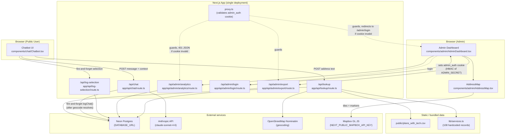
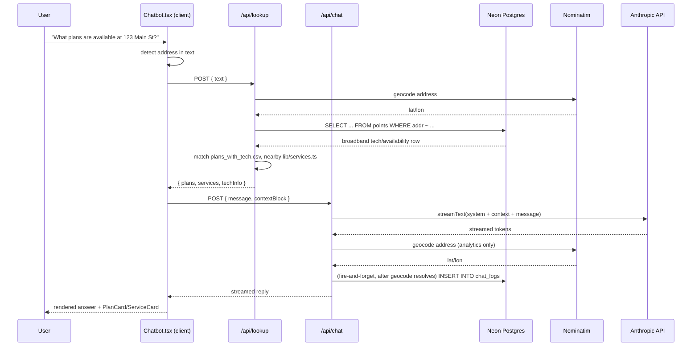
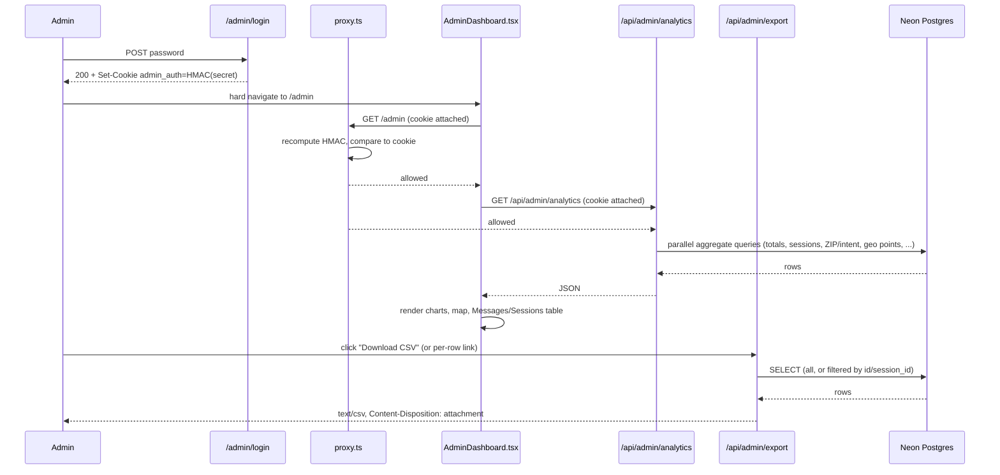

# Architecture

`cc-chatbot-v2` ("Clark County Digital Navigator Assistant") is a **single Next.js 16 application** — there is no monorepo and no separate backend service. Everything (UI, API routes, data access) runs inside one Next.js process. This document maps out how the pieces fit together, where data lives, and where the app is (and isn't) currently deployed.

## 1. High-level shape



## 2. Logical "services" (all inside one app)

There are no independently deployed microservices. Instead, the app has two logical surfaces that share the same codebase, database, and deployment:

### A. Public chatbot surface

| Piece | File | Role |
|---|---|---|
| UI | [components/chat/Chatbot.tsx](components/chat/Chatbot.tsx) | Client component. Runs lightweight regex-based intent classification ("plans" vs "services") and address detection, orchestrates calls to the two API routes below, and manages the guided plan-recommendation / service-filter flows (`PlanFlowState` / `ServiceFlowState`). Renders `PlanCard` / `ServiceCard` / `PlansTable` / `ServicesTable` alongside streamed chat text. When a follow-up message doesn't repeat the address or name a new topic, it falls back to re-rendering the last successful lookup's cards rather than showing nothing. |
| CSV download (per result) | [components/chat/DownloadCsvButton.tsx](components/chat/DownloadCsvButton.tsx) + [lib/csv.ts](lib/csv.ts) | Client-side only — builds a CSV Blob and triggers a browser download of the plans/services currently shown to the user. No server round-trip. |
| Address/plan/service lookup | [app/api/lookup/route.ts](app/api/lookup/route.ts) | `POST`. Extracts an address from free text ([lib/address.ts](lib/address.ts)), geocodes it via Nominatim, checks broadband availability in Postgres (`points` table), matches ISP plans from the bundled CSV ([lib/plans.ts](lib/plans.ts)), and finds nearby digital-equity resources by haversine distance ([lib/services-lookup.ts](lib/services-lookup.ts) over [lib/services.ts](lib/services.ts)). Results are cached in-memory ([lib/cache.ts](lib/cache.ts): 30 min TTL on hits, 5 min on misses). |
| Chat / LLM streaming | [app/api/chat/route.ts](app/api/chat/route.ts) | `POST`. Streams a response from Claude (`claude-sonnet-4-6` via `@ai-sdk/anthropic` + Vercel AI SDK's `streamText`), with a system prompt plus a context block built client-side from the `/api/lookup` result. When an address was parsed, geocoding resolves *before* the analytics write (fixed — previously the write fired first and always recorded `lat`/`long` as null; see §3). |
| Guided-flow selection logging | [app/api/log-selection/route.ts](app/api/log-selection/route.ts) → [lib/analytics.ts](lib/analytics.ts) `logSelection()` | `POST`. Household size / usage profile / service-type-filter choices happen entirely client-side (no `/api/chat` call necessarily follows), so they're posted here as a fire-and-forget update to the most recent `chat_logs` row for that session. |
| Plan/recommendation helpers | [lib/plan-utils.ts](lib/plan-utils.ts) | Shared `Plan`/`PlanGroups` types, `HOUSEHOLD_SIZE_OPTIONS`/`USAGE_PROFILE_OPTIONS`, and `recommendPlan()` — the algorithm behind the guided "get a personalized recommendation" flow. Also imported by the admin dashboard to label its household/usage charts. |

### B. Admin surface (`/admin`)

| Piece | File | Role |
|---|---|---|
| Dashboard UI | [components/admin/AdminDashboard.tsx](components/admin/AdminDashboard.tsx), mounted from [app/admin/page.tsx](app/admin/page.tsx) | Fetches `/api/admin/analytics` once on mount and renders: totals, Recharts bar charts (daily activity, intent breakdown, household size, usage profile, service type filtered, **ZIP code searched by intent**), an **address search map**, and a Messages/Sessions toggle table with CSV download — both "download everything" and a per-row download link (single message or single session transcript). |
| Address map | [components/admin/AddressMap.tsx](components/admin/AddressMap.tsx) | Client-only (`next/dynamic`, `ssr: false`). Renders a Mapbox GL map of geocoded address searches, colored/pinned by intent, with click popups. Requires `NEXT_PUBLIC_MAPBOX_API_KEY`. |
| Login | [app/admin/login/page.tsx](app/admin/login/page.tsx) → [app/api/admin/login/route.ts](app/api/admin/login/route.ts) | Compares submitted password to `process.env.ADMIN_SECRET` (plain `!==` comparison — not constant-time, a minor hardening opportunity rather than a functional gap). On success, sets an `admin_auth` httpOnly cookie (8-hour maxAge, `sameSite: 'lax'`) containing an HMAC-SHA256 token — **not** the raw secret — computed by [lib/admin-auth.ts](lib/admin-auth.ts) `getAdminToken()`. The login page does a hard `window.location.href` redirect (not `router.push`) after success, because the layout's own sidebar `<Link href="/admin">` prefetches that route while logged out, and the client router cache would otherwise serve that stale pre-auth response. |
| Auth guard | [proxy.ts](proxy.ts) | Next.js 16's `middleware.ts` equivalent (the file was renamed upstream; `matcher: ['/admin', '/admin/:path*', '/api/admin/:path*']`). Recomputes the expected HMAC token from `ADMIN_SECRET` and compares it to the `admin_auth` cookie on every matched request. Lets `/admin/login` and `/api/admin/login` through unconditionally; otherwise redirects `/admin/*` to the login page and returns a 401 JSON body for `/api/admin/*` when the cookie is missing or wrong. **This actually enforces auth** — it is not a no-op. |
| Analytics API | [app/api/admin/analytics/route.ts](app/api/admin/analytics/route.ts) | `GET`. Runs several aggregate queries against `chat_logs` in parallel: totals, by-intent, by-day (30d), recent messages, recent session rollups ([lib/sessions.ts](lib/sessions.ts)), by-household-size, by-usage-profile, by-service-type, by-ZIP-and-intent, and geocoded address points ([lib/geo.ts](lib/geo.ts)). |
| Export API | [app/api/admin/export/route.ts](app/api/admin/export/route.ts) | `GET`, query-string driven: `?type=messages` (all rows) / `?type=sessions` (all session rollups) / `?type=message&id=<id>` (one row) / `?type=session&id=<session_id>` (one session's full transcript). Streams a CSV response (`Papa.unparse`) with a `Content-Disposition: attachment` header — plain `<a download>` links, no client-side JS needed. |

There is no RPC, message queue, or network hop between "services" — they communicate only via (1) direct in-process function calls between `app/api/*` route handlers and `lib/*` modules, and (2) the shared Neon Postgres database.

## 3. Data stores & static data

| Store | Where | Contents | Provisioning |
|---|---|---|---|
| Neon Postgres | `DATABASE_URL` env var, client in [lib/db.ts](lib/db.ts) | `points` table: address-level FCC/BDC broadband availability (`addr, city, state, zip, bld_type, brandnames, techbest, techrules, max_dl, max_ul, fixedcnt, cschoice, lat, long`) — also used to backfill map coordinates for `chat_logs` rows logged before the fix below (see [lib/geo.ts](lib/geo.ts) `addressPointsQuery()`, which re-splits `address_queried` and joins back to `points`). `chat_logs` table: per-message analytics (`id, session_id, created_at, user_message, intent, address_queried, lat, long, num_plans_returned, num_services_returned, household_size, usage_profile, service_type_selected`). | ⚠️ No migration files or schema-definition scripts exist in this repo. Both tables must already exist on the Neon instance — they were provisioned out-of-band. |
| Bundled CSV | [public/plans_with_tech.csv](public/plans_with_tech.csv) | ISP plan catalog (provider, price, speeds, data cap, contract terms, low-income discount, etc.). | Loaded synchronously at module-init via `fs.readFileSync` + Papaparse in [lib/plans.ts](lib/plans.ts). Baked into the deployed build — updating plans means editing/redeploying this file, not a DB write. |
| Hardcoded TS array | [lib/services.ts](lib/services.ts) | 108 digital-equity resource records (73 local Clark County/Las Vegas orgs + 35 national programs). Per its header comment, generated from `digital_inclusion_resources_claude enhanced.xlsx`. | Same as above — code change + redeploy to update. |

**Fixed:** `chat_logs.lat`/`long` used to always be `NULL` — [app/api/chat/route.ts](app/api/chat/route.ts) called `logChat()` synchronously right after *firing* (not awaiting) the Nominatim geocode, so the insert always ran before the coordinates resolved. It now chains the DB write onto the geocode promise instead, so new rows get real coordinates without blocking the streamed chat response.

## 4. External dependencies

| Service | Used for | Auth | Called from |
|---|---|---|---|
| **Anthropic API** (Claude, model `claude-sonnet-4-6`) | Generating the chatbot's streamed replies | `ANTHROPIC_API_KEY` | [app/api/chat/route.ts](app/api/chat/route.ts) via `@ai-sdk/anthropic` |
| **Neon Postgres** (serverless driver) | Broadband availability lookups, chat analytics, admin dashboard/export queries | `DATABASE_URL` | [lib/db.ts](lib/db.ts) |
| **OpenStreetMap Nominatim** | Free-text address → lat/lon geocoding | None (custom `User-Agent: ClarkCountyDigitalEquityChatbot/2.0` header) | [lib/address.ts](lib/address.ts) `geocodeAddress()` |
| **Mapbox GL JS** | Rendering the admin "address search locations" map (tiles, markers) | `NEXT_PUBLIC_MAPBOX_API_KEY` — a client-exposed *public* token (Mapbox tokens are meant to be used in browser JS; access is restricted by domain in the Mapbox account, not by secrecy) | [components/admin/AddressMap.tsx](components/admin/AddressMap.tsx) |

No Slack, Stripe, OpenAI, or Supabase integration exists in the code.

## 5. Configuration / environment variables

Only `.env.local` exists (git-ignored; no `.env.example` is checked in). Variables actually **read by the running app**:

- `ANTHROPIC_API_KEY` — Claude API auth (implicit, via `@ai-sdk/anthropic`)
- `DATABASE_URL` — Neon Postgres connection string ([lib/db.ts](lib/db.ts))
- `ADMIN_SECRET` — admin password + HMAC signing key for the `admin_auth` cookie ([app/api/admin/login/route.ts](app/api/admin/login/route.ts), [lib/admin-auth.ts](lib/admin-auth.ts), [proxy.ts](proxy.ts)) — **must be set in every environment this app runs in**, including each Vercel deployment target, or login silently fails
- `NEXT_PUBLIC_MAPBOX_API_KEY` — Mapbox access token, bundled into client JS for the admin address map ([components/admin/AddressMap.tsx](components/admin/AddressMap.tsx)) — also needs to be set per Vercel environment, or the map renders with no tiles

Variables present in `.env.local` but **not referenced anywhere in current source** (likely leftovers from an earlier iteration, possibly an S3-based pipeline that originally loaded the `points` table):

- `REACT_APP_API_URL`
- `MAPBOX_API_KEY` (superseded by `NEXT_PUBLIC_MAPBOX_API_KEY`, which holds the same value but is actually read)
- `S3_BUCKET`
- `S3_POINTS_KEY`
- `AWS_REGION`

> ⚠️ Rotate/secure the values in `.env.local` before sharing this repo further — it currently holds a live-looking Postgres connection string and an Anthropic API key in plaintext.

## 6. Hosting / infrastructure — current state

**Nothing is committed to this repo for CI/CD or infrastructure.** Specifically absent: `.github/workflows/*`, `vercel.json`, `netlify.toml`, `Dockerfile`, `docker-compose.yml`, `serverless.yml`, `amplify.yml`, `terraform/`, `render.yaml`, `fly.toml`, and there is no `deploy` script in `package.json`.

The stack is *shaped* for Vercel (the `@neondatabase/serverless` driver is built for edge/serverless runtimes, and the app uses the Vercel AI SDK). In practice this app **is** deployed on Vercel (observed at `cc-chatbot-dev-coral.vercel.app`), but that project's configuration lives entirely in the Vercel dashboard — not in this repo. A recurring gotcha: adding a new env var (e.g. `ADMIN_SECRET`, `NEXT_PUBLIC_MAPBOX_API_KEY`) to `.env.local` has no effect on that deployment until the same variable is also added in the Vercel project settings and a new deployment is triggered.

**Local dev port:** [.claude/launch.json](.claude/launch.json) runs the Claude Code preview server on port 3001 (`npm run dev -- -p 3001`). Running `npm run dev` directly uses Next.js's default port 3000.

### What's missing for a reproducible deployment

If/when this gets deployed for real, the following should be added:
1. A `vercel.json` (or equivalent platform config) and a documented deploy step.
2. SQL migration files for the `points` and `chat_logs` tables (currently exist only as live schema on the Neon instance — not reproducible from this repo).
3. An `.env.example` listing the four variables actually in use (`ANTHROPIC_API_KEY`, `DATABASE_URL`, `ADMIN_SECRET`, `NEXT_PUBLIC_MAPBOX_API_KEY`), with the five unused ones removed once confirmed dead.
4. A constant-time comparison for the admin password check in [app/api/admin/login/route.ts](app/api/admin/login/route.ts) (currently a plain `!==`).

## 7. Request flow examples

### Address lookup → chat



### Admin dashboard load → export



## 8. Directory reference

```
app/
├── page.tsx                       # Public chatbot page
├── layout.tsx, globals.css
├── admin/
│   ├── layout.tsx, page.tsx       # Admin dashboard
│   └── login/page.tsx             # Admin login form
└── api/
    ├── chat/route.ts              # Claude streaming endpoint
    ├── lookup/route.ts            # Address/plan/service lookup endpoint
    ├── log-selection/route.ts     # Fire-and-forget guided-flow selection logging
    └── admin/
        ├── login/route.ts         # Sets admin_auth cookie
        ├── analytics/route.ts     # Reads chat_logs for the dashboard
        └── export/route.ts        # CSV export (all / per-message / per-session)

components/
├── chat/       # Chatbot.tsx, PlanCard/ServiceCard/PlansTable/ServicesTable,
│               # ChoiceButtons, PromptSuggestions, CopyButton, DownloadCsvButton, SortableTable
├── admin/      # AdminDashboard.tsx, AddressMap.tsx
└── ui/         # shadcn/ui primitives (badge, button, card, scroll-area, separator)

lib/
├── db.ts               # Neon Postgres client
├── address.ts          # Address extraction + Nominatim geocoding + points lookup
├── plans.ts             # CSV plan loading/matching
├── plan-utils.ts        # Plan/PlanGroups types, household/usage options, recommendPlan()
├── services.ts          # Static digital-equity resource data (108 records)
├── services-lookup.ts   # Haversine distance grouping
├── sessions.ts           # Session-level chat_logs rollup query (admin)
├── geo.ts                # ZIP/intent aggregation + address→lat/long backfill (admin)
├── admin-auth.ts         # HMAC-SHA256 admin session token
├── csv.ts                # Client-side CSV blob builder (public-facing download button)
├── cache.ts             # In-memory TTL/LRU cache factory
├── analytics.ts         # logChat() / logSelection() → chat_logs insert/update
└── utils.ts             # cn() helper

public/
└── plans_with_tech.csv  # Bundled ISP plan catalog

proxy.ts                 # Next.js 16's middleware.ts equivalent — enforces admin_auth
                          # cookie check on /admin/* and /api/admin/*
```
