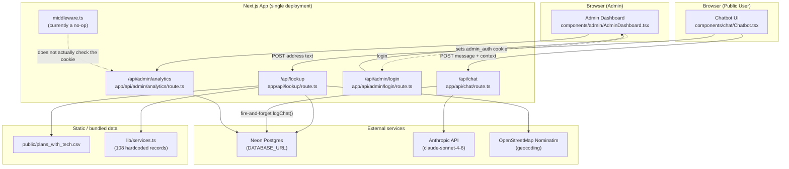
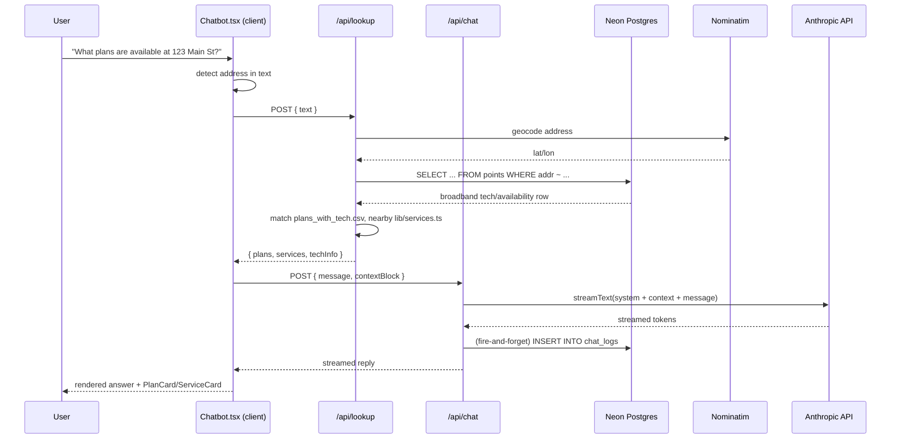

# Architecture

`cc-chatbot-v2` ("Clark County Digital Equity Assistant") is a **single Next.js 16 application** — there is no monorepo and no separate backend service. Everything (UI, API routes, data access) runs inside one Next.js process. This document maps out how the pieces fit together, where data lives, and where the app is (and isn't) currently deployed.

## 1. High-level shape



## 2. Logical "services" (all inside one app)

There are no independently deployed microservices. Instead, the app has two logical surfaces that share the same codebase, database, and deployment:

### A. Public chatbot surface

| Piece | File | Role |
|---|---|---|
| UI | [components/chat/Chatbot.tsx](components/chat/Chatbot.tsx) | Client component. Runs lightweight regex-based intent classification ("plans" vs "services") and orchestrates calls to the two API routes below. Renders `PlanCard` / `ServiceCard` alongside streamed chat text. |
| Address/plan/service lookup | [app/api/lookup/route.ts](app/api/lookup/route.ts) | `POST`. Extracts an address from free text ([lib/address.ts](lib/address.ts)), geocodes it via Nominatim, checks broadband availability in Postgres (`points` table), matches ISP plans from the bundled CSV ([lib/plans.ts](lib/plans.ts)), and finds nearby digital-equity resources by haversine distance ([lib/services-lookup.ts](lib/services-lookup.ts) over [lib/services.ts](lib/services.ts)). Results are cached in-memory ([lib/cache.ts](lib/cache.ts): 30 min TTL on hits, 5 min on misses). |
| Chat / LLM streaming | [app/api/chat/route.ts](app/api/chat/route.ts) | `POST`. Streams a response from Claude (`claude-sonnet-4-6` via `@ai-sdk/anthropic` + Vercel AI SDK's `streamText`), with a system prompt plus a context block built client-side from the `/api/lookup` result. Also fires a non-blocking write to `chat_logs` via [lib/analytics.ts](lib/analytics.ts). |

### B. Admin surface (`/admin`)

| Piece | File | Role |
|---|---|---|
| Dashboard UI | [components/admin/AdminDashboard.tsx](components/admin/AdminDashboard.tsx), mounted from [app/admin/page.tsx](app/admin/page.tsx) | Fetches analytics and renders Recharts bar charts + a recent-messages table. |
| Login | [app/admin/login/page.tsx](app/admin/login/page.tsx) → [app/api/admin/login/route.ts](app/api/admin/login/route.ts) | Compares submitted password to `process.env.ADMIN_SECRET`; on success sets an `admin_auth` httpOnly cookie (8-hour maxAge) containing the raw secret value. |
| Analytics API | [app/api/admin/analytics/route.ts](app/api/admin/analytics/route.ts) | `GET`. Reads aggregate stats from the `chat_logs` Postgres table. |

**Known gap:** [middleware.ts](middleware.ts) is currently `return NextResponse.next()` — a no-op. Nothing in the app actually validates the `admin_auth` cookie before serving `/admin` pages or the `/api/admin/analytics` route. As written, the admin dashboard and its analytics endpoint are reachable without authentication despite the login screen existing. **This should be fixed before any real deployment** — either restore cookie-checking logic in `middleware.ts` (matched against `/admin/*` and `/api/admin/*`) or gate the routes individually.

There is no RPC, message queue, or network hop between "services" — they communicate only via (1) direct in-process function calls between `app/api/*` route handlers and `lib/*` modules, and (2) the shared Neon Postgres database.

## 3. Data stores & static data

| Store | Where | Contents | Provisioning |
|---|---|---|---|
| Neon Postgres | `DATABASE_URL` env var, client in [lib/db.ts](lib/db.ts) | `points` table: address-level FCC/BDC broadband availability (`addr, city, state, zip, bld_type, brandnames, techbest, techrules, max_dl, max_ul, fixedcnt, cschoice, lat, long`). `chat_logs` table: per-message analytics (`session_id, created_at, user_message, intent, address_queried, lat, long, num_plans_returned, num_services_returned`). | ⚠️ No migration files or schema-definition scripts exist in this repo. Both tables must already exist on the Neon instance — they were provisioned out-of-band. |
| Bundled CSV | [public/plans_with_tech.csv](public/plans_with_tech.csv) | ISP plan catalog (provider, price, speeds, data cap, contract terms, low-income discount, etc.). | Loaded synchronously at module-init via `fs.readFileSync` + Papaparse in [lib/plans.ts](lib/plans.ts). Baked into the deployed build — updating plans means editing/redeploying this file, not a DB write. |
| Hardcoded TS array | [lib/services.ts](lib/services.ts) | 108 digital-equity resource records (73 local Clark County/Las Vegas orgs + 35 national programs). Per its header comment, generated from `digital_inclusion_resources_claude enhanced.xlsx`. | Same as above — code change + redeploy to update. |

## 4. External dependencies

| Service | Used for | Auth | Called from |
|---|---|---|---|
| **Anthropic API** (Claude, model `claude-sonnet-4-6`) | Generating the chatbot's streamed replies | `ANTHROPIC_API_KEY` | [app/api/chat/route.ts](app/api/chat/route.ts) via `@ai-sdk/anthropic` |
| **Neon Postgres** (serverless driver) | Broadband availability lookups, chat analytics | `DATABASE_URL` | [lib/db.ts](lib/db.ts) |
| **OpenStreetMap Nominatim** | Free-text address → lat/lon geocoding | None (custom `User-Agent: ClarkCountyDigitalEquityChatbot/2.0` header) | [lib/address.ts](lib/address.ts) `geocodeAddress()` |

No Slack, Stripe, OpenAI, Supabase, or Mapbox integration currently exists in the *code*, despite some of those appearing as env var names (see below).

## 5. Configuration / environment variables

Only `.env.local` exists (git-ignored; no `.env.example` is checked in). Variables actually **read by the running app**:

- `ANTHROPIC_API_KEY` — Claude API auth (implicit, via `@ai-sdk/anthropic`)
- `DATABASE_URL` — Neon Postgres connection string ([lib/db.ts](lib/db.ts))
- `ADMIN_SECRET` — plaintext-compared admin password ([app/api/admin/login/route.ts](app/api/admin/login/route.ts))

Variables present in `.env.local` but **not referenced anywhere in current source** (likely leftovers from an earlier iteration, possibly an S3-based pipeline that originally loaded the `points` table):

- `REACT_APP_API_URL`
- `MAPBOX_API_KEY`
- `S3_BUCKET`
- `S3_POINTS_KEY`
- `AWS_REGION`

> ⚠️ Rotate/secure the values in `.env.local` before sharing this repo further — it currently holds a live-looking Postgres connection string and an Anthropic API key in plaintext.

## 6. Hosting / infrastructure — current state

**Nothing is committed to this repo for CI/CD or infrastructure.** Specifically absent: `.github/workflows/*`, `vercel.json`, `netlify.toml`, `Dockerfile`, `docker-compose.yml`, `serverless.yml`, `amplify.yml`, `terraform/`, `render.yaml`, `fly.toml`, and there is no `deploy` script in `package.json`.

The stack is *shaped* for Vercel (the `@neondatabase/serverless` driver is built for edge/serverless runtimes, and the app uses the Vercel AI SDK), but no actual Vercel project configuration is checked in. Wherever this app is currently reachable in practice, that deployment was set up manually/out-of-band — it is not reproducible from this repo alone.

**Local dev port:** [.claude/launch.json](.claude/launch.json) runs the Claude Code preview server on port 3001 (`npm run dev -- -p 3001`). Running `npm run dev` directly uses Next.js's default port 3000.

### What's missing for a reproducible deployment

If/when this gets deployed for real, the following should be added:
1. A `vercel.json` (or equivalent platform config) and a documented deploy step.
2. SQL migration files for the `points` and `chat_logs` tables (currently exist only as live schema on the Neon instance — not reproducible from this repo).
3. An `.env.example` listing the three variables actually in use (`ANTHROPIC_API_KEY`, `DATABASE_URL`, `ADMIN_SECRET`), with the five unused ones removed once confirmed dead.
4. Actual cookie validation in `middleware.ts` for `/admin/*` and `/api/admin/*` — see the known gap in §2.

## 7. Request flow example (address lookup → chat)



## 8. Directory reference

```
app/
├── page.tsx                       # Public chatbot page
├── layout.tsx, globals.css
├── admin/
│   ├── layout.tsx, page.tsx       # Admin dashboard
│   └── login/page.tsx             # Admin login form
└── api/
    ├── chat/route.ts              # Claude streaming endpoint
    ├── lookup/route.ts            # Address/plan/service lookup endpoint
    └── admin/
        ├── login/route.ts         # Sets admin_auth cookie
        └── analytics/route.ts     # Reads chat_logs for the dashboard

components/
├── chat/       # Chatbot.tsx, PlanCard.tsx, ServiceCard.tsx, PromptSuggestions.tsx, CopyButton.tsx
├── admin/      # AdminDashboard.tsx
└── ui/         # shadcn/ui primitives (badge, button, card, scroll-area, separator)

lib/
├── db.ts               # Neon Postgres client
├── address.ts          # Address extraction + Nominatim geocoding + points lookup
├── plans.ts            # CSV plan loading/matching
├── services.ts         # Static digital-equity resource data (108 records)
├── services-lookup.ts  # Haversine distance grouping
├── cache.ts            # In-memory TTL/LRU cache factory
├── analytics.ts        # logChat() → chat_logs insert
└── utils.ts             # cn() helper

public/
└── plans_with_tech.csv  # Bundled ISP plan catalog

middleware.ts            # No-op passthrough (see known gap, §2)
```
